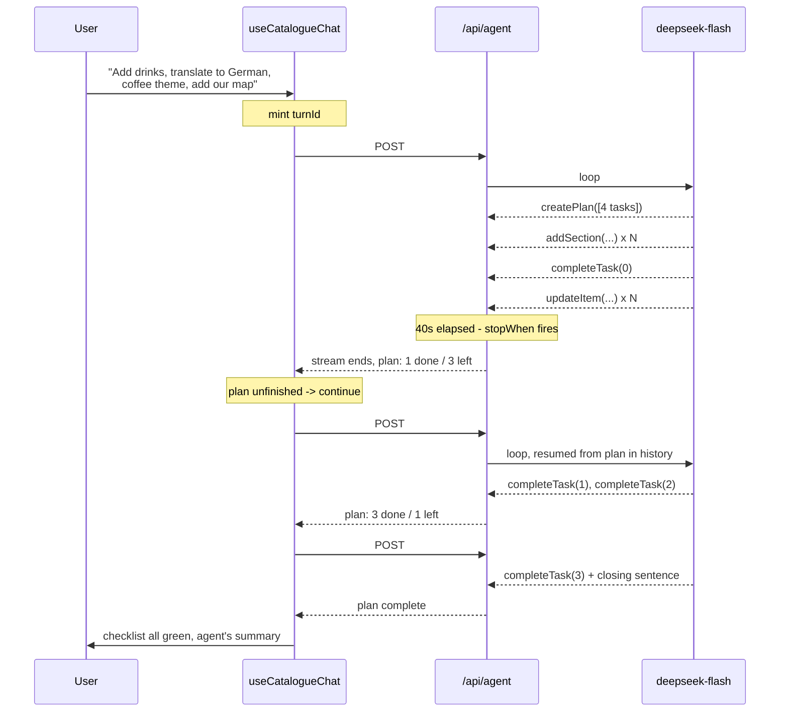

# AI agent - plan mode and credits

Two connected proposals for the builder's AI agent on branch `test`:

1. **Plan mode** - a multi-part request becomes a visible to-do list, and the agent
   works it across several requests so no single one has to finish inside Vercel's
   60-second ceiling.
2. **Credits** - replace the `ai_prompts` counter with a credit ledger, because plan
   mode makes "one prompt" stop meaning anything.

Read `docs/architecture/ai-chat-flow.md` first if you have not; this document assumes the boxes
in it.

**Status: Part 1 is built. Part 2 is not.** What shipped follows this plan with
four deliberate departures, all noted in place below:

- **No `turnId`.** The `prompts` table lives in `@quicktalog/common` and has no
  column to dedupe on, so the route simply does not meter a request that is
  resuming a plan. One ask still costs one prompt. It trusts the message history,
  which is client-supplied; the airtight version is Part 2's ledger.
- **`AGENT_TIMEOUT_MS` went from 30s to 50s.** The old ceiling was chosen for a
  single-shot turn and sits below the 38s budget, so every long turn would have
  ended as a timeout error rather than a paused plan.
- **The resume policy is a pure function**, `resumeDecision` in `agent/plan.ts`,
  rather than conditionals in the effect. It is the part that must not be wrong,
  and this way it is tested without React.
- **A plan is scoped to the ask that created it.** Not in the original design, and
  a bug without it: a user abandons a half-finished list by typing something else,
  and the loop would otherwise pick the old one back up.

**§1.7 (context compaction) was not built.** Every resume still resends the whole
history. It is the one piece of this design still outstanding, and the first thing
to do if long plans prove expensive.

---

## Part 1 - Plan mode

### 1.1 The problem

`app/api/agent/route.ts` sets `maxDuration = 60`. One POST carries one tool loop of
up to `MAX_AGENT_STEPS = 16` (`agent/model.ts`). A request like

> *"Add a drinks menu, translate the whole catalogue to German, switch to the coffee
> theme, and put our Google Map at the bottom"*

is four unrelated pieces of work. The agent starts them in one loop and the platform
kills the function partway. What the user is left with is the worst possible state:
some edits applied to the draft, no closing message, and no record of what was left
undone. The draft is not saved, so they cannot even tell what landed by reloading.

Raising `maxDuration` is not the fix. Even on a plan that allows 300s, a user
watching a spinner for four minutes with no idea what is happening is a worse
product than one watching four tasks tick green - and the failure mode is identical,
just later.

### 1.2 The shape of the fix

The 60 seconds is **per HTTP request**. A new request is a new budget. So: keep each
request short, and make the *client* drive as many requests as the plan needs.



Three requests, three fresh 60-second budgets, one `turnId`, one charge.

### 1.3 What carries across a request boundary

This is the part the idea lives or dies on, and most of it is already free:

| What | How it survives | Work needed |
|---|---|---|
| The catalogue state | The client sends `context.catalogue` in the body every time, and `useCatalogueChat` has already replayed each tool's operation into the draft as it streamed. Request #2 therefore gets a snapshot that *already contains* request #1's edits. | none |
| The conversation | `useChat` posts the whole `messages` array. Every tool call and result from request #1 is in it. | trimming only (§1.7) |
| Loaded skills | `loadedSkillsFromMessages(messages)` in the route already rehydrates these from history. | none |
| **The plan** | Nothing carries it today. | **new: `planFromMessages()`, same trick as skills** |
| The charge | Nothing links the requests today. | **new: `turnId` (Part 2)** |

The plan rehydrates from the message history exactly the way skills do - no database,
no server-side session store, no cache key to expire. The newest `completeTask` or
`createPlan` tool output in the history *is* the plan state.

### 1.4 Server changes

**`agent/plan.ts`** (new)

```ts
export type PlanTaskStatus = "pending" | "done" | "skipped";

export interface PlanTask {
  title: string;              // one short line, in the user's language
  status: PlanTaskStatus;
  note?: string;              // what the agent actually did, or why it skipped
}

export interface PlanState {
  tasks: PlanTask[];
  revision: number;           // bumped on every mutation; the loop guard reads it
}

/** Rehydrates the newest plan from the UI message history. */
export function planFromMessages(messages: unknown[]): PlanState | null;

export const MAX_PLAN_TASKS = 12;
```

**`agent/session.ts`** gains, alongside the existing `fetches` / `readWeb` gates:

```ts
plan: PlanState | null;
private readonly startedAt = Date.now();

createPlan(titles: string[]): AgentToolResult;   // refuses a second plan
completeTask(index: number, note?: string): AgentToolResult;
skipTask(index: number, reason: string): AgentToolResult;

/** True once the turn has spent its share of the 60s. */
outOfTime(): boolean { return Date.now() - this.startedAt > TURN_BUDGET_MS; }

/** Rendered into the instructions on a continuation. */
planSnapshot(): string;
```

`TURN_BUDGET_MS = 40_000`. Forty of the sixty seconds is the decision point: a step
already in flight when the budget expires still needs to finish and the stream still
needs to flush, and a single `addSection` with twenty items and twenty Unsplash
lookups is comfortably a ten-second step.

**`agent/tools.ts`** gains three tools, built the same way as the rest (errors
returned, never thrown, so the model corrects itself):

| Tool | Input | Returns |
|---|---|---|
| `createPlan` | `tasks: string[]` (2-12, each ≤ 120 chars) | `{ ok: true, plan }` - or an error if a plan already exists |
| `completeTask` | `task: number`, `note?: string` | `{ ok: true, plan, remaining }` |
| `skipTask` | `task: number`, `reason: string` | `{ ok: true, plan, remaining }` |

`skipTask` matters more than it looks: without it, a task the agent cannot do (the
user asked for a section type their plan does not unlock, or an embed they never
supplied the snippet for) leaves the plan permanently unfinished, and the client
keeps sending continuations into a wall.

**`agent/index.ts`** - the stop condition becomes a pair:

```ts
stopWhen: [stepCountIs(MAX_AGENT_STEPS), () => session.outOfTime()]
```

The agent keeps taking tasks until the clock says stop, which is the "as many as fit
in ~40 seconds" behaviour: three trivial tasks land in one request, one big
menu-build takes a request to itself.

**`agent/instructions.ts`** - one new block, and one conditional block:

```
Working through a multi-part request:
- When the user asks for several distinct things at once, or for something that will
  take many edits, call createPlan first with one short line per piece of work,
  written in the user's language. Then work the tasks in order.
- Call completeTask as soon as a task's edits are done, before starting the next one.
  If a task cannot be done, call skipTask with the reason.
- Do not call createPlan for a single small change. Just make it.
- Never create a second plan. If the user changes what they want mid-plan, finish or
  skip what is left and say so.
```

and, only when the request is a continuation:

```
PLAN (resumed - you already did the ticked work, the CATALOGUE snapshot shows it):
  [x] Add a drinks menu - added "Drinks" with 8 items
  [ ] Translate everything to German
  [ ] Switch to the coffee theme
  [ ] Add the Google Map
Continue with the first unticked task. Do not redo ticked work and do not re-plan.
```

**`app/api/agent/route.ts`** - passes the rehydrated plan into the session the same
way it passes skills, and reads `turnId` out of the body for metering (Part 2).

### 1.5 Client changes

All in `hooks/useCatalogueChat.ts`, which already has the two pieces this needs: it
watches settled tool parts in an effect, and it owns `sendMessage`.

```ts
const turnId = useRef<string | null>(null);        // one per user request
const continuations = useRef(0);
const lastRevision = useRef(-1);
const stopped = useRef(false);

const MAX_CONTINUATIONS = 8;
```

`send()` mints `turnId.current = crypto.randomUUID()`, resets the three counters, and
passes `turnId` in the body. A new effect runs the loop:

```
when status becomes "ready":
  plan = latest plan tool output in messages
  if no plan, or no pending tasks      -> done, clear turnId
  if error, or user pressed stop       -> done
  if continuations >= MAX_CONTINUATIONS -> done, surface "stopped after N rounds"
  if plan.revision === lastRevision     -> done, surface "could not make progress"
  else: continuations++; sendMessage(CONTINUE marker, same turnId, current draft)
```

The revision check is the important guard. Without it, a model that stops calling
`completeTask` - because it is confused, or because every remaining task keeps
failing - produces an infinite loop of paid requests. One round that changes nothing
ends the loop.

`stop()` sets `stopped.current = true` so the user's Stop button actually stops the
*plan*, not just the current stream. `reset()` clears all four refs.

The continuation message is a text part holding a marker constant, the same pattern
`SCANNED_TEXT_MARKER` already uses in `agent/attachments.ts`. `ChatMessageBubble`
returns `null` for it, so the transcript shows the user's one real message and the
agent's work - not eight synthetic "continue" bubbles.

### 1.6 UI

**`components/catalogue/chat/PlanChecklist.tsx`** (new) - one card, rendered from the
*newest* plan state found anywhere in the transcript rather than once per message, so
the user sees one list that fills in rather than four stale copies of it:

```
  Working through 4 things                      2 / 4
  ✓  Add a drinks menu
  ✓  Translate everything to German
  ◐  Switch to the coffee theme
  ○  Add the Google Map
```

`✓` done (with the agent's note on hover or below), `◐` the one being worked now,
`○` pending, `⊘` skipped in amber with the reason. It sits above the composer in
`CatalogueChat.tsx` while the plan is running, then drops into the transcript as a
final summary once it finishes.

`RUNNING_LABELS` in `ChatMessageBubble.tsx` gets the three new tools, though in
practice the checklist is the better status display and the per-tool spinner lines
for plan tools can be suppressed.

**Why this is worth building even if the timeout disappeared.** The user sees what
was understood from their request *before* the edits start, so a misread ("translate
to German" read as "add a German section") is caught in two seconds rather than after
thirty. That is the real feature; surviving the 60s ceiling is the side effect.

### 1.7 Context growth

Every continuation resends the full history. A 12-task plan at 8 continuations
resends every tool call and result from every earlier round, and the agent's own
`custom_code` outputs are measured in tens of kilobytes.

Add `compactForContinuation(messages)` in the route, before the session is built:

- keep the original user message (the request itself),
- keep the newest plan tool output (the state),
- keep the last two assistant messages in full,
- drop older assistant messages entirely.

Older tool detail is genuinely redundant: the `CATALOGUE` snapshot is rebuilt from
the live draft every request and already reflects every edit those messages made.
This is the same reasoning behind the existing "never repeat an earlier turn's
operation, the snapshot already contains it" rule.

**Drop whole messages, never individual parts.** Tool calls and their results must
stay paired when the UI messages are converted to model messages; splitting a message
breaks that pairing and the provider rejects the request.

### 1.8 Failure modes

| Failure | What happens | Handling |
|---|---|---|
| Model never calls `createPlan` on a multi-part request | Behaves exactly as today - one request, maybe a timeout | Acceptable. The instruction is a nudge, not a guarantee; nothing regresses |
| Model calls `createPlan` for a one-line change | A checklist for a trivial edit, plus a wasted round trip | Instruction says not to; a 2-task minimum in the schema enforces the floor |
| Model stops calling `completeTask` | Would loop forever | Revision guard ends it after one no-progress round |
| A task fails every time (locked section type, missing embed snippet) | Would loop until `MAX_CONTINUATIONS` | `skipTask` is the escape hatch; the instruction points at it |
| User edits the draft by hand mid-plan | Later tasks work against a changed catalogue | Already safe - operations are id-addressed, and each request re-snapshots the live draft |
| User closes the builder mid-plan | The loop dies with the component | Fine - nothing was persisted anyway. The draft keeps whatever landed |
| Request #3 fails (network, 500) | Loop stops, plan shows partial progress | The checklist is the record of what got done. Offer a "continue" button rather than auto-retrying |
| User sends a new message mid-plan | Two loops racing | `send()` must abort the running plan first: `stop()`, clear `turnId` |

### 1.9 Work breakdown

| # | Change | Files |
|---|---|---|
| 1 | Plan types, `planFromMessages`, constants | `agent/plan.ts` (new) |
| 2 | Plan state, `outOfTime`, `planSnapshot` on the session | `agent/session.ts` |
| 3 | `createPlan` / `completeTask` / `skipTask` tools | `agent/tools.ts`, `agent/schemas.ts` |
| 4 | Planning instructions + resume block | `agent/instructions.ts` |
| 5 | Deadline stop condition | `agent/index.ts`, `agent/model.ts` |
| 6 | Rehydrate plan, read `turnId`, compact history | `app/api/agent/route.ts` |
| 7 | Continuation loop, guards, `turnId` | `hooks/useCatalogueChat.ts` |
| 8 | Checklist card, marker suppression | `components/catalogue/chat/PlanChecklist.tsx` (new), `CatalogueChat.tsx`, `ChatMessageBubble.tsx` |
| 9 | Credits (Part 2) | `lib/ai/access.ts`, `lib/ai/credits.ts` (new), migration, `fetchUserData.ts` |
| 10 | Docs | `docs/architecture/ai-chat-flow.md` - plan mode changes several of its boxes |

Of these, 1-6 and 8 are built, 7 is built as `resumeDecision` plus the effect that
carries it out, and 9-10 are not.

Tests, alongside the existing `tests/unit/agent/` suite:

- `plan.test.ts` - rehydration from a history with one, several and zero plan outputs;
  a malformed output is ignored rather than throwing.
- `session.test.ts` - a second `createPlan` is refused; `completeTask` on an
  out-of-range index returns a readable error; `outOfTime` flips at the budget.
- `route.test.ts` - a continuation body rebuilds the plan; compaction keeps
  tool-call/result pairing intact.
- `useCatalogueChat.test.ts` - loop continues while tasks are pending; stops on
  unchanged revision, on `MAX_CONTINUATIONS`, on error, and on `stop()`; `turnId` is
  stable across continuations and new per `send()`.

Steps 1-6 are independently shippable: with no client loop the agent simply plans,
does what fits in 40 seconds, and stops - strictly better than today's hard cut-off.
Steps 7-8 turn it into the full experience.

---

## Part 2 - Credits instead of prompts

### 2.1 Why `ai_prompts` stops working

Today one row in `prompts` is inserted per request that changed something
(`lib/ai/access.ts`, `meter`). Plan mode turns one user request into up to nine of
them. Charging nine is indefensible; charging one means a user who asks for a
40-item menu build pays the same as one who asks to bold a heading. The counter has
no relationship to what anything costs or is worth.

There is a second problem it already has: the unit is meaningless to the user. "200
AI prompts per month" tells nobody whether that builds one catalogue or fifty. And a
third: the app has at least four AI surfaces - the agent, `writeItemDescription`, the
OCR import, and the external catalogue generator behind `/api/ai` that
`components/create/AIBuilder.tsx` calls - and two separate counters (`prompts`,
`ocr`) that cannot be traded off against each other.

### 2.2 The model

One balance, `ai_credits`, refilled monthly by the plan. Every AI action has a price
in credits. Work costs more than talk.

**`public.ai_credits`** replaces `prompts` and, in time, `ocr`:

```sql
create table public.ai_credits (
  id         uuid primary key default gen_random_uuid(),
  datetime   timestamptz not null default now(),
  user_id    text not null,
  catalogue  text,
  turn_id    uuid,            -- one user request; null for non-chat actions
  action     text not null,   -- 'chat.turn', 'chat.task', 'web.fetch', ...
  credits    integer not null,
  metadata   jsonb            -- model, tokens, task title: for analysis, not billing
);

create index ai_credits_user_datetime_idx on public.ai_credits (user_id, datetime);

-- the whole of Part 1 charged once, for free:
create unique index ai_credits_turn_base_idx
  on public.ai_credits (turn_id)
  where action = 'chat.turn';
```

That partial unique index is the entire "one charge per user request" mechanism.
Every request in a plan inserts its `chat.turn` row with `onConflictDoNothing`; the
first wins, continuations #2-#9 no-op. No coordination, no cache, no race.

A ledger rather than a counter also means you can finally answer "what is this user
actually spending credits on", which `SELECT count(*) FROM prompts` never could.

### 2.3 The price list

| Action | Credits | Why |
|---|---|---|
| `chat.turn` | **1** | Once per user request, plan or not. Covers the base model cost |
| `chat.task` | **1** | Per task completed beyond the first. A 4-task plan costs 4, a one-liner costs 1 |
| `chat.question` | **0** | A turn that applied no edits and fetched nothing stays free, as it is today |
| `web.fetch` | **2** | The only hard per-call external cost in the loop (Firecrawl). Capped at 3 per conversation in `session.ts` |
| `image.lookup` | **0** | Unsplash is free and already capped at 24 per turn |
| `item.describe` | **1** | `writeItemDescription` - one short single-shot call |
| `ocr.import` | **5** | Scanning replaces a lot of typing; price it like the work it saves |
| `catalogue.generate` | **10** | The `/api/ai` full-catalogue build behind `AIBuilder` - the single most expensive action in the product |

Two properties to preserve when you tune these numbers:

- **A question is free.** It is the cheapest thing to serve and the thing that makes
  users trust the assistant enough to let it edit.
- **The floor is 1.** The simplest useful action costs exactly one credit, so "1
  credit ≈ one small change" is a sentence you can put in the pricing page.

The numbers above are ratios, not revenue. Set the absolute allowance from the
margin you want on `deepseek-flash` plus Firecrawl at each tier.

### 2.4 Allowances

Convert rather than re-derive, so nobody loses ground on migration day:

```
ai_credits = ai_prompts × 5
```

Five is the observed centre of gravity: a typical session is a couple of one-task
edits and one multi-part build. Verify it against the real distribution before
committing - a week of `prompts` rows grouped by user gives you the histogram, and
the ledger's `action` column gives you the real answer a month after launch.

`PricingPlan.features` gains `ai_credits`; `ai_prompts` stays in place, unused, until
the migration finishes. The tier values live in `@quicktalog/common` (not installed
in this checkout, so the concrete numbers are not written here) - apply the factor to
each tier's existing `ai_prompts` there.

### 2.5 Enforcement

`lib/ai/access.ts` keeps its shape. `authorize()` swaps its counter check for a
balance check and returns the balance:

```ts
const balance = plan.features.ai_credits - usage.credits;
if (balance <= 0) return { ok: false, error: "...", code: "limit" };
return { ok: true, userId, balance, ... };
```

**Check before, charge after.** The pre-flight check is a floor test only - it asks
"has this user got anything left", not "can they afford what they are about to do",
because nobody knows the price of a turn until it is over. The charge is written in
`onFinish`, where `meter()` is called today, from what the session actually did:

```ts
onFinish: async () => {
  await charge(auth.userId, catalogueName, turnId, [
    ...(session.applied.length > 0 ? [{ action: "chat.turn", credits: 1 }] : []),
    ...session.tasksCompletedThisRequest.map(() => ({ action: "chat.task", credits: 1 })),
    ...times(session.fetchesThisRequest, () => ({ action: "web.fetch", credits: 2 })),
  ]);
}
```

A user can therefore finish a plan a few credits into the red. That is the right
trade: the alternative is abandoning a half-applied plan mid-way, which leaves the
draft in exactly the broken state Part 1 exists to prevent. Let the last plan
overshoot and block the *next* request.

Two things must be fixed in the same change:

- **`helpers/client.ts:21-23`.** `startOfMonth` and `endOfMonth` are computed once at
  module import and mix local-time boundaries with a UTC `timestamptz` column. In a
  long-lived server process they never roll over, so balances silently stop resetting.
  Compute them per call. This is a live bug for `prompts` today; it becomes a billing
  bug for credits.
- **`fetchUserData`.** Add `usage.credits` as a `SUM(credits)` over the window
  alongside the existing `COUNT(*)`s.

### 2.6 Migration

1. Ship the table, `ai_credits` on every plan, and `lib/ai/credits.ts`.
2. **Dual-write**: keep inserting into `prompts`, start inserting into `ai_credits`.
   Enforce on `prompts` still. Compare for two weeks - the ledger tells you what the
   new prices would have charged each user before anyone is affected by them.
3. Flip enforcement to credits. Dashboard and limit modals switch to the credit
   balance. Pricing page rewrites "200 AI prompts" as "1000 AI credits" plus a short
   "what a credit buys" table.
4. Stop writing `prompts`; leave the table for history. Fold `ocr` in as
   `ocr.import` rows at the same time.

### 2.7 UI

- `components/dashboard/MonthlyUsage.tsx` - the "AI Prompts" donut becomes "AI
  Credits". The OCR donut folds into it once `ocr.import` is a ledger action; until
  then both render.
- `components/modals/limits/limitContent.ts` - the `ai` limit copy switches to
  credits and gains the next tier's credit figure.
- `components/home/Pricing/PricingColumn.tsx` - `"{n} AI prompts per month"` becomes
  `"{n} AI credits per month"`, with the price list from §2.3 rendered nearby.
  Without that table the number means nothing.
- `components/catalogue/chat/CatalogueChat.tsx` - show the remaining balance in the
  panel footer. Today a user only discovers they are out when a modal appears, which
  is worse under credits because the cost per request is no longer constant.
- The plan checklist is the natural place to show what a plan will cost before it
  runs: *"4 things · about 4 credits"*, once `createPlan` has returned and before the
  first edit lands.

---

## Decisions already taken

| Question | Answer |
|---|---|
| How much work per request? | As much as fits in ~40s, then stop cleanly at a step boundary |
| What does a multi-task request cost? | One `chat.turn` credit for the request, plus one `chat.task` per task |
| How is that enforced across requests? | Client-minted `turnId` + a partial unique index on the ledger |
| Where does plan state live? | In the message history, rehydrated per request - same as skills |

## Still open

1. **Should the user be able to edit the plan before it runs?** A "remove this task"
   affordance on the checklist is cheap to build and would catch misreadings, but it
   means the plan has to be writable from the client, which is a new trust boundary.
2. **`MAX_CONTINUATIONS = 8` and `MAX_PLAN_TASKS = 12`** are guesses. Instrument
   first, tune after.
3. **Resume after a failure.** Everything needed for a "continue where it stopped"
   button exists in the transcript. Worth it only if the failure rate justifies it.
4. **Does a skipped task still cost a credit?** Proposed: no. Only `completeTask`
   charges. Watch for a model that learns to skip its way to cheapness.
