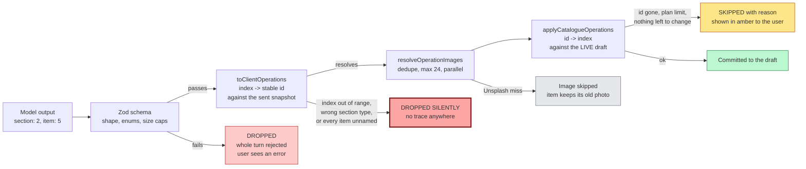
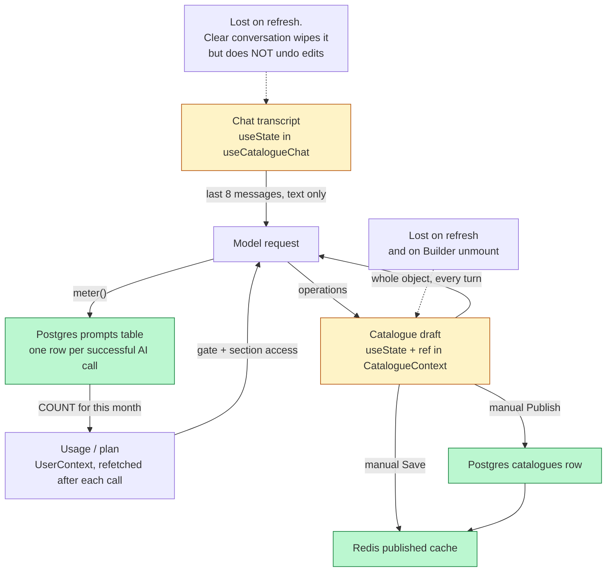

# AI Chat - Agent Flow

How the builder's "Ask AI" assistant works, end to end, on branch `test`.

This is the map you edit when you change the agent. Every box is a real function
in the repo, with the file it lives in. If you add a step, add a box.

---

## 1. The short version

The chat is **not** an agent loop. It is a **single-shot JSON translator** wrapped in
guards.

> One user message + a text snapshot of the current catalogue go to DeepSeek.
> It replies with one JSON object: a sentence for the human, and a flat list of
> edit operations. The server validates that list, swaps positions for stable ids,
> resolves photo searches, and hands it back. The browser replays the operations
> against the in-memory builder draft and reports what landed.

There is no tool calling, no streaming, no retry, no second turn. One request in,
one batch of edits out. Nothing is saved to the database - the user still presses
**Save** or **Publish**.

Five properties fall out of that design, and they are the ones to protect when you
change anything:

| Property | Where it comes from |
|---|---|
| The AI sees **unsaved** builder state | The whole client `catalogue` object travels with every message |
| Ownership can't be spoofed by the client | `authorize()` re-reads `createdBy` from the DB, ignoring the payload |
| A bad model reply can't corrupt the draft | Zod validates before anything is applied |
| A batch is order-independent* | Positions become stable ids server-side, before the client applies them |
| The model can't invent image URLs | It only emits a search term; the server resolves it |

\* One exception: `add_section.position` is the only field **not** converted to an id.
`toClientOperations` passes the raw index straight through, and the applier splices
against the array *as it stands mid-batch*. Two positioned `add_section`s in one
turn - or one following a `delete_section` - will not land where the model meant.

---

## 2. The whole flow

```mermaid
flowchart TD
    subgraph CLIENT["BROWSER - builder page, /admin/[name]/builder"]
        A1[User types a message or clicks a suggestion]
        A2["CatalogueChat.submit<br/>guard: non-empty and not loading"]
        A3["useCatalogueChat.send<br/>guard: catalogue.name exists"]
        A4["Build history<br/>last 8 messages, role + content only"]
        A5[Append user message to transcript]
        A6{"useAiAssist.run<br/>client quota gate<br/>usage.prompts >= ai_prompts?"}
        A7["Open AI LimitsModal<br/>no server call made"]
        A8[setLoading true]
    end

    subgraph SERVER["SERVER ACTION - chatEditCatalogue, server_actions/ai.ts"]
        B1{"message non-empty<br/>and catalogue present?"}
        B2["authorize(catalogueName)"]
        B3{"Clerk currentUser"}
        B4{"Catalogue row exists?"}
        B5{"createdBy === user.id?"}
        B5a{"fetchUserData ok?"}
        B5b["FAILS OPEN<br/>no quota cap, and every<br/>section type advertised"]
        B6{"usage.prompts < plan.ai_prompts?"}
        B7["Read sectionAccess<br/>plan.features.sections"]
        B8["Trim history + message<br/>last 8 messages, each 2000 chars"]
        B9["buildEditorSystemPrompt<br/>rules + allowed ops + snapshot"]
    end

    subgraph MODEL["DEEPSEEK - utils/deepseek.ts"]
        C1["generateChatJSON<br/>deepseek-chat, temp 0.3<br/>response_format json_object"]
        C2{"finish_reason === length?"}
        C3{"JSON.parse succeeds?"}
        C4["Raw object<br/>{ reply, operations[] }"]
    end

    subgraph PIPE["VALIDATE AND RESOLVE - lib/ai/catalogueEditor.ts"]
        D1{"catalogueEditResponseSchema<br/>zod safeParse"}
        D2["toClientOperations<br/>section/item index to stable id"]
        D3["resolveOperationImages<br/>imageQuery to Unsplash URL"]
        D4["meter()<br/>INSERT INTO prompts"]
    end

    subgraph APPLY["BROWSER - applying the batch"]
        E1["refreshUserData<br/>re-count monthly usage"]
        E2{"operations.length > 0?"}
        E3["context.applyOperations<br/>with plan limits"]
        E4["applyCatalogueOperations<br/>non-mutating, id-addressed<br/>helpers/catalogueOperations.ts"]
        E5{"applied.length > 0?"}
        E6["Commit new catalogue<br/>catalogueRef + setCatalogue"]
        E7["Discard - draft unchanged"]
        E8{"limitReached?"}
        E9[Open items LimitsModal]
        E10["Append assistant message<br/>reply + changes[] + skipped[]"]
        E11["ChatMessageBubble renders<br/>text, green checks, amber warnings"]
    end

    subgraph SAVE["PERSISTENCE - separate, manual"]
        F1["User presses Save or Publish<br/>ActionButtons"]
        F2["Save: updateCatalogue<br/>Redis only, no Postgres write"]
        F3["Publish: publishCatalogue<br/>Postgres + Redis"]
    end

    ERR["Return AiActionResult<br/>success false + code + message"]
    ERRUI["Append error text as an<br/>assistant message<br/>non-limit codes only"]

    A1 --> A2 --> A3 --> A4 --> A5 --> A6
    A6 -- over limit --> A7
    A6 -- under limit --> A8 --> B1

    B1 -- no --> ERR
    B1 -- yes --> B2 --> B3
    B3 -- not signed in --> ERR
    B3 -- ok --> B4
    B4 -- missing --> ERR
    B4 -- found --> B5
    B5 -- not owner --> ERR
    B5 -- owner --> B5a
    B5a -- "DB error / no plan" --> B5b --> B8
    B5a -- ok --> B6
    B6 -- quota spent --> A7
    B6 -- ok --> B7 --> B8 --> B9 --> C1

    C1 --> C2
    C2 -- yes --> ERR
    C2 -- no --> C3
    C3 -- no --> ERR
    C3 -- yes --> C4 --> D1
    D1 -- invalid --> ERR
    D1 -- valid --> D2 --> D3 --> D4 --> E1

    ERR --> ERRUI
    ERRUI --> E11

    E1 --> E2
    E2 -- "no ops: a question,<br/>or all dropped upstream" --> E10
    E2 -- yes --> E3 --> E4 --> E5
    E5 -- yes --> E6 --> E8
    E5 -- no --> E7 --> E8
    E8 -- yes --> E9 --> E10
    E8 -- no --> E10
    E10 --> E11
    E11 -.-> F1
    F1 --> F2
    F1 --> F3

    style A7 fill:#fde68a,stroke:#b45309
    style E9 fill:#fde68a,stroke:#b45309
    style ERR fill:#fecaca,stroke:#b91c1c
    style ERRUI fill:#fecaca,stroke:#b91c1c
    style B5b fill:#fca5a5,stroke:#7f1d1d,stroke-width:3px
    style E7 fill:#e5e7eb,stroke:#6b7280
    style C4 fill:#bfdbfe,stroke:#1d4ed8
    style E6 fill:#bbf7d0,stroke:#15803d
```



Three things about this diagram that are easy to miss:

- **Quota rejections never reach the transcript.** Both the client gate (A6) and the
  server gate (B6) open the same AI `LimitsModal`. `useAiAssist.run` special-cases
  `code === "limit"` and does not call `onError`, so nothing is appended - the
  transcript is left ending on an unanswered user message. Only `unauthorized`,
  `not_found` and `ai_error` become error bubbles.
- **`authorize` fails open.** The quota check sits inside `if (userData.ok && userData.data)`.
  If `fetchUserData` returns `ok: false` - missing user, no plan, or a failed usage
  query - the turn runs with **no monthly cap**, and `sectionAccess` is `undefined`,
  which makes `allowedSectionTypes` advertise every type including the paid ones.
- **Error bubbles re-enter the model's context.** Failures are appended with
  `role: "assistant"`, and the next turn's history is built from that same array -
  so *"Generation failed. Try again."* is sent back to DeepSeek as if the assistant
  had said it.

---

## 3. The operation pipeline

This is the part worth understanding in detail - it is where correctness lives,
and where edits silently disappear.

The model never sees an id. It addresses things by the `[index]` printed in the
snapshot. Those indices are converted to stable ids **on the server**, against the
same snapshot the model was shown. Only then does the browser apply them.



The two "dropped" paths behave very differently, and that asymmetry is the single
biggest UX bug in the current flow:

- **`applyCatalogueOperations` drops loudly.** Every skip pushes a human sentence
  into `skipped[]`, which the bubble renders in amber. The user knows.
- **`toClientOperations` drops silently.** If the model points at section `[7]`
  when only 6 exist, the operation vanishes with no record. The assistant still
  says *"Done - I added that."* The user believes a change happened that never did.

There are three silent-drop routes through `toClientOperations`, not one:

1. The section or item index does not exist in the snapshot.
2. The index points at a block that cannot hold items (`text`, `divider`,
   `embedding`, `custom_code`) for an item operation.
3. `toItemInputs` filters out every item the model left unnamed, and `add_items`
   then discards the whole operation because nothing survived.

One near-miss worth knowing: an `update_item` whose *only* field was an `imageQuery`
that Unsplash missed arrives at the applier with an empty patch, and comes out as an
amber `Nothing to change on "X".` - so that particular case is visible after all.

---

## 4. What actually goes into the prompt

`buildEditorSystemPrompt()` assembles one system message every turn. It has four parts:

**1. The output contract** - reply with only `{"reply": string, "operations": [...]}`.
`reply` is one or two sentences in the user's language and must never mention JSON,
operations or indices.

**2. The operation vocabulary** - ten operations, written out as literal JSON shapes:

```
add_section     update_section    delete_section    move_section
add_items       update_item       delete_item       move_item
update_catalogue                  update_appearance
```

**3. The rules** - roughly twenty of them, and they encode real bugs that were hit:

- Never repeat an earlier turn's operation; the snapshot already contains it.
- New thing means `add_section`; only use `update_section` when the user clearly
  points at an existing one.
- `embedding` code must come from the user; never invent a src or an API key.
- `custom_code` is original code you write: one self-contained fragment, no CDN,
  no external fonts or images.
- Never paste catalogue text into a JS string literal - one apostrophe in
  *Chef's Special* silently kills the widget. Put the data in a
  `<script type="application/json" id="...">` tag and read it back with
  `JSON.parse(document.getElementById("...").textContent)`.
- Never use `getElementById` or bare `document.querySelector`, and never set `id`
  attributes - the same widget can render twice and ids collide. Start with
  `var root = document.currentScript.parentNode`.

> **These last two rules contradict each other.** One instructs the model to give a
> `<script>` tag an `id` and read it back with `getElementById`; the next forbids both.
> A third rule ("prefix your class names and ids") assumes ids are allowed. The model
> has to violate one of them on every `custom_code` turn. See **H5**.
- Run setup at the top level; never wrap it in `DOMContentLoaded` - the script is
  injected after load, so the event has already fired.
- Section types the plan does not unlock are named explicitly as forbidden.
- Photos: never write a URL, only an English `imageQuery` of two or three words.

**4. The snapshot** - `buildCatalogueSnapshot()` renders the catalogue as a compact
position-indexed outline. HTML is stripped, descriptions truncated to 80 chars,
items that already have a photo are tagged `[img]`:

```
SLUG: my-cafe
HEADING: Welcome to My Cafe
CURRENCY: EUR | LANGUAGE: en | BUSINESS TYPE: cafe
APPEARANCE: theme=theme-coffee font=Inter size=medium radius=12 shadow=low
SECTIONS (2):
  [0] category "Coffee" layout=variant_1 items=3
    [0] "Espresso" 2.5 [img] - Single shot, dark roast
    [1] "Flat White" 3.2 - Double shot with steamed milk
    [2] "Cold Brew" 3.8
  [1] text "About" - "We roast in small batches every Tuesday."
```

**Note the memory model.** Conversation history is *text only* - the assistant's
previous **operations** are never replayed. The agent knows what it did on earlier
turns solely because the fresh snapshot already reflects it. This is deliberate and
it is why the "never repeat an operation, check the snapshot first" rule exists.

---

## 5. Every limit and cap in one place

| Cap | Value | Where |
|---|---|---|
| History **messages** sent to model | 8 - a flat user+assistant slice, so ≈4 turns | `useCatalogueChat.ts` and `ai.ts` (both sides) |
| Chars per history message | 2000 | `ai.ts` |
| Chars in the current user message | 2000 | `ai.ts` |
| Snapshot sections rendered | 40 | `catalogueEditor.ts` |
| Snapshot items per section | 40 | `catalogueEditor.ts` |
| Item description in snapshot | 80 chars | `catalogueEditor.ts` |
| Heading in snapshot | 160 chars | `catalogueEditor.ts` |
| Text-section body in snapshot | 160 chars | `catalogueEditor.ts` |
| `custom_code` / `embedding` hint in snapshot | 140 chars | `catalogueEditor.ts` |
| Operations per turn | 40 | zod `MAX_OPERATIONS` |
| `custom_code` / `embedding` size | 40 000 chars | zod `MAX_CODE_CHARS` |
| Text-section `content` | 4000 chars | zod |
| Catalogue `heading` | 2000 chars | zod |
| Items per `add_section` / `add_items` | 40 | zod |
| `reply` length | 1200 chars | zod |
| Unsplash lookups per turn | 24, deduped | `MAX_IMAGE_LOOKUPS` |
| Monthly AI calls | `plan.features.ai_prompts` | checked client **and** server |
| Sections per catalogue | `plan.features.sections_per_catalogue` | applied client-side; **`text` blocks are exempt** |
| Items per catalogue | `plan.features.items_per_catalogue` | applied client-side |
| Model temperature | 0.3 | `ai.ts` |
| `max_tokens` | **not set** | - |
| Request timeout | **not set** | - |
| Retries | **none** | - |
| Rate limit per minute | **none** | - |

Note the naming trap: the constants are called `HISTORY_TURNS` and `CHAT_HISTORY_LIMIT`,
but both slice a flat message array. Eight messages is four exchanges, not eight.

---

## 6. Where the state lives



Four things are worth saying out loud:

- **Nothing the chat does is persisted.** Both the transcript and the edits die on
  refresh. `CatalogueBuilder` even calls `resetCatalogue()` on unmount.
- **The quota is charged server-side, before the client applies anything.** A turn
  that only asks a question costs a prompt. So does a turn where every operation is
  later dropped by a plan limit.
- **Save and Publish are not the same operation.** `updateCatalogue` writes **only**
  to Redis - there is no `drizzle.update` in it. Postgres is written by
  `publishCatalogue` alone. A user who only ever presses Save has their work living
  in the cache.
- **"Clear conversation" only clears the transcript.** Every edit the AI already
  made stays in the draft. There is no way to walk them back.

---

## 7. Improvement hooks

Mapped to the stages above, so you can pick one and know exactly which box you're
changing. Ordered roughly by value per unit of work.

### Correctness

**H1 - Stop dropping operations silently.** *(pipeline, `toClientOperations`)*
Return the discarded ops alongside the resolved ones and merge them into `skipped[]`.
Right now the reply says *"Done"* while nothing happened. This is the fix with the
highest ratio of user trust to lines of code.

**H2 - Fix the monthly quota window.** *(server, `helpers/client.ts`)*
`startOfMonth` and `endOfMonth` are module-level constants computed once at import.
In a long-lived server process they never roll over, and they mix local-time
boundaries with a UTC `timestamptz` column. Compute them per call.

**H3 - Don't charge for turns that changed nothing.** *(server, `meter`)*
Either meter only when `operations.length > 0`, or return the metering decision to
the client and charge after `applied.length > 0` is known.

**H4 - Sanitize `custom_code` before it reaches a published page.** *(pipeline)*
Today the only defence is prompt text. The model writes arbitrary HTML, CSS and JS
that ends up on the customer's live catalogue. A server-side allowlist pass -
or at minimum stripping `<script src>`, `fetch`, and `XMLHttpRequest` - closes a
real hole.

**H5 - Resolve the id contradiction in the `custom_code` rules.** *(prompt)*
One rule tells the model to put data in a `<script type="application/json" id="...">`
and read it with `getElementById`; the next forbids ids and `getElementById` outright.
Every widget the model writes breaks one of them. Pick one: keep the JSON-in-a-script
pattern but address it with `root.querySelector('script[type="application/json"]')`,
and drop "and ids" from the prefix rule.

**H6 - Close the fail-open hole in `authorize`.** *(server)*
When `fetchUserData` fails, the quota check is skipped entirely and `sectionAccess`
comes back `undefined`, which the prompt reads as *everything unlocked*. A DB blip
currently grants unlimited prompts and paid section types. Fail closed, or at least
fall back to the most restrictive plan.

**H7 - Convert `add_section.position` to an id-relative anchor.** *(pipeline)*
It is the last raw index in the batch and it breaks the order-independence the rest
of the design works hard for. `afterSectionId` would be enough.

### Reliability

**H8 - Recover from truncation instead of apologising.** *(model call)*
`finish_reason === "length"` is already detected. Set an explicit `max_tokens`, and
on truncation retry once with an instruction to emit fewer operations, rather than
telling the user to rephrase.

**H9 - Add a timeout and one retry.** *(model call)*
The OpenAI client is created with no `timeout` and no `maxRetries` override. A hung
DeepSeek request currently hangs the whole turn with no ceiling.

**H10 - Rate-limit per user per minute.** *(server, before `authorize`)*
The monthly count is the only throttle. `@upstash/redis` is already a dependency;
adding `@upstash/ratelimit` in front of `chatEditCatalogue` is a small change.

**H11 - Cache Unsplash lookups.** *(pipeline)*
Every turn hits the Unsplash API fresh, up to 24 times in parallel, with no cache,
no retry and no status check. A miss is detected by string-comparing against a
hardcoded Squarespace placeholder URL - brittle if that upstream default ever
changes. Cache by query in Redis and key the miss on a sentinel you control.

### Visibility

**H12 - Instrument the chat.** *(everywhere)*
There is **no** PostHog event anywhere in the chat path, and no deliberate Sentry
span - only exception capture. (`@sentry/nextjs` auto-instruments server actions at
`tracesSampleRate: 0.1` in production, so a coarse transaction probably exists, but
nothing carries chat-specific attributes.) You cannot answer "what fraction of turns
produce zero operations", "which operations get skipped most", or "how long does a
turn take". Minimum useful set: turn started, turn succeeded, op count, applied
count, skipped count, latency, and the failure code.

**H13 - Log token usage.** *(model call)*
`completion.usage` is discarded. Recording it is the only way to reason about cost
per turn or to justify prompt-size work.

### Experience

**H14 - Stream the reply.** *(model call → UI)*
The call is fully blocking and the user watches *"Working on it..."* for the whole
round trip, which on a large catalogue with 24 image lookups is many seconds.
Streaming `reply` first, then applying operations, would make it feel far faster
without changing the contract.

**H15 - Add undo.** *(apply stage)*
`applyCatalogueOperations` never mutates its input, and `CatalogueContext` is holding
the pre-operation catalogue in `catalogueRef.current` at the exact moment it
overwrites it. Stashing that value per turn gives you a one-click *Undo this change*
on each assistant bubble for very little work. Note the outcome object returns the
**new** catalogue, not the old one - the old state has to come from the ref.

**H16 - Persist the transcript.** *(client state)*
A refresh loses the conversation while the draft edits it produced may still be
there. Even `sessionStorage` keyed by catalogue slug would close the gap.

**H17 - Show the quota in the panel.** *(client)*
The user only discovers they are out of prompts when the modal appears - and when the
*server* rejects on quota, nothing is appended to the transcript at all, so the last
thing on screen is their own unanswered message. `usage.prompts` and `ai_prompts` are
both already in `UserContext`.

**H18 - Fix the React keys in `ChatMessageBubble`.** *(client)*
Both lists key on the string itself - `key={change}` and `key={reason}`. The skipped
list is the worse offender: two identical reasons in one turn
(`"Could not find the section to update."` twice) is entirely normal.

**H19 - Don't feed error text back to the model.** *(client state)*
Failure messages are appended with `role: "assistant"` and end up in the next turn's
history. Tag them and filter them out when building `history`.

### Architecture

**H20 - Send a diff, not the whole catalogue.** *(client → server)*
The entire catalogue object is serialised on every message. For a large catalogue
this is the dominant payload cost and it grows with the user's success.

**H21 - Consider a second pass for big asks.** *(model call)*
"Build me a whole menu" hits the 40-operation cap and truncation. A plan-then-execute
split - one call that outlines sections, then one call per section - would make large
requests reliable. This is the change that would turn the translator into an actual
agent loop, so weigh it against how much simplicity you lose.

**H22 - Give the model a way to ask for more of the catalogue.** *(prompt)*
Past 40 sections or 40 items it is addressing content it cannot see. The snapshot
says *"…and N more"*, but there is no operation for *show me the rest*.

---

## 8. File map

| File | Role |
|---|---|
| `components/catalogue/chat/CatalogueChat.tsx` | Floating panel, suggestions, input, both limit modals |
| `components/catalogue/chat/ChatMessageBubble.tsx` | One bubble: text, applied changes, skipped reasons |
| `hooks/useCatalogueChat.ts` | Orchestrates a turn: history, send, apply, append |
| `hooks/useAiAssist.ts` | Client quota gate, loading/error state, usage refresh |
| `server_actions/ai.ts` | `chatEditCatalogue` + `authorize` + `meter`, and the item-description assist |
| `lib/ai/catalogueEditor.ts` | System prompt, snapshot, zod schema, index→id, image resolution |
| `helpers/catalogueOperations.ts` | Pure operation applier with plan limits |
| `context/CatalogueContext.tsx` | `applyOperations`, holds the unsaved draft |
| `utils/deepseek.ts` | DeepSeek client, JSON mode, `DeepseekResponseError` |
| `types/ai.ts` | `CatalogueOperation` union and result types |
| `lib/users/fetchUserData.ts` | Plan + monthly usage counts |
| `tests/unit/server_actions/ai.test.ts` | Turn behaviour: metering, ownership, truncation |
| `tests/unit/lib/ai/catalogueEditor.test.ts` | Snapshot, index→id, image resolution |
| `tests/unit/helpers/catalogueOperations.test.ts` | Apply semantics and limit skips |

### Sibling AI feature

One other action lives in `server_actions/ai.ts` and shares `authorize` + `meter`
but not the operation pipeline. It is single-shot and returns plain data:

- `writeItemDescription` - one string, temp 0.7

Bulk item generation (paste-a-list, generate-a-category) was removed; the chat
agent covers it.
